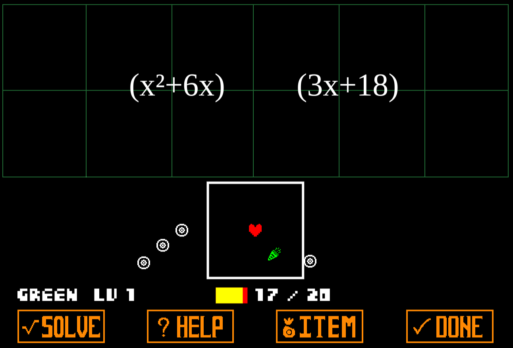

# Factortale

This was a simple JavaScript game created in a week during my second year of
high school that demonstrates factoring, inspired by Undertale. It utilitizes no
game engine, and features various inside jokes from the class that you probably
won't understand.

[Play it Here](https://richgrov.github.io/Factortale/)

This was not tested on many platforms and you may experience bugs related to
fonts, images, or other assets not loading correctly.
